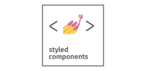
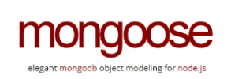

<p align="center">
  
</p>
<!-- 
#   -->


## Table of contents

- [Motivations](#motivations)
- [Screenshots](#screenshots)
- [Tools and Technologies](#toolsAndTechnologies)
- [Setup](#setup)
- [Features](#features)
- [Status](#status)
- [Inspiration](#inspiration)
- [Contact](#contact)


## Motivations

The global pandemic has completely solidified the need for e-commerce. Where it used to be just one of many options we had when it came to making a purchase, e-commerce instead became the primary method of shopping. With all non-essential shops closed across the world for large swathes of 2020 and 2021, and an increasing number of us concerned about social distancing, shopping online became the norm and we saw dramatic e-commerce sales growth. 

With experience in maintaining merchants' e-commerce stores, it felt natural to take the next step and develop an independent functioning e-commerce app.  Not only does this expand knowledge and experience in developing applications executing the MERN stack, but also gives a better understanding of maintaining apps that have already been established.  

This is an eCommerce platform built with the MERN stack, Redux and GraphQL.

Link to our website hosted on Heroku: [Felicity](https://rocky-fortress-93078.herokuapp.com/)

## Screenshots

<p align="center">Front Page</p>


<p align="center">Shopping and Login/Create Account Pages</p>


<p align="center">Stripe Checkout</p>


<p align="center">

</p>

Customers will have the ability to create an account through a signup form found on the `Navigation Bar` whereupon users can add items to their cart if so desired. Utilization of the `Navigation Bar` or homepage buttons will help customers select shopping items for purchase. Once items are stored in the cart, customers will be able to checkout via Stripe before being redirected back to the website.


## Architecture


## Tools and Technology

[](https://nodejs.org/en/) [](https://www.npmjs.com/package/express)

[](https://www.npmjs.com/package/bootstrap) [](https://www.npmjs.com/package/apollo-server-express)

[](http://wwww.mongodb.com/) [](https://www.npmjs.com/package/graphql)

[](https://www.npmjs.com/package/styled-components) [](https://www.npmjs.com/package/react)

[](https://www.npmjs.com/package/react-scripts) [](https://www.npmjs.com/package/react-bootstrap)

[](https://www.npmjs.com/package/react-router-dom) [](https://www.npmjs.com/package/stripe)

[](https://www.heroku.com) [](https://www.npmjs.com/package/jsonwebtoken)

[](https://www.npmjs.com/package/mongoose)


### GraphQL

GraphQL is a query language for APIs and a runtime for fulfilling queries with existing data. In our application, we used it as an API to fetch data from our MongoDB database.


## Setup

Download a copy of this repo to a directory of your choice. To install, you will need to run `npm i` or `npm install` to get all the dependencies running. Following proper installation of the dependencies, you will type `npm start` on the root directory terminal to start the server.

To stop the server you will need to use the existing terminal to execute `CTRL+C` followed by `Y` for confirmation to terminate the connection to localhost.

Please see documentation on your own host's server commands should you run this on a live instance rather than locally.

## Usage
Be sure all repository files were successfully cloned to server and a connection to the database is complete.


### Building


```
npm run build
```

Authentication using JSON Web Tokens (JWT).
Option to add, edit, view and delete all the items in our store.
Option to add items or remove items from the cart for the user.
Display the total bill of the cart and update it as soon as the cart is updated by the user.
Using Local Storage to store the JWT so that we only allow logged-in users to buy items.
Option to pay using Stripe Checkout and thus creating a new order and emptying the cart after payment is successful.


## Features


Considerations for improvement: 


## Inspiration


## Contact

Created by: 
- [Alina Zaidi](https://github.com/az84)
- [Lucas DiFalco](https://github.com/ldifalco)
